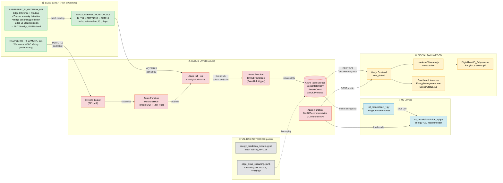
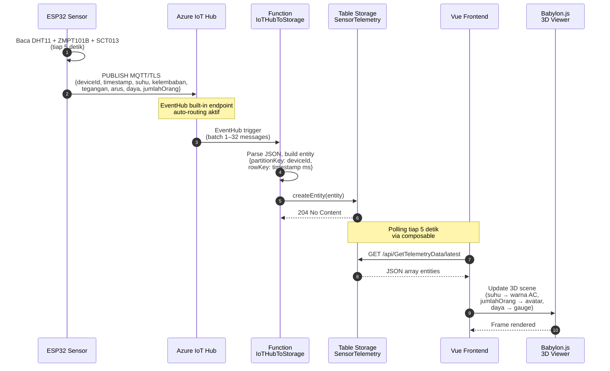

# Arsitektur Edge-Cloud untuk Estimasi Daya Near Real-Time Bangunan Cerdas Terintegrasi Digital Twin Web-3D

Dokumen ini menjelaskan arsitektur **end-to-end** sistem, dari sensor fisik di gedung hingga visualisasi 3D di browser, sebagai bukti integrasi keempat pilar judul jurnal:

1. **Arsitektur Edge-Cloud** — pemisahan komputasi antara edge (gateway Raspberry Pi) dan cloud (Azure Functions)
2. **Estimasi Daya** — model ML (Ridge Regression, Random Forest) untuk memprediksi `daya` dari sensor lingkungan
3. **Near Real-Time** — pipeline streaming dengan latensi terukur (P50 edge ≈1.3 ms, cloud ≈321 ms)
4. **Digital Twin Web-3D** — Vue.js + Babylon.js menampilkan model 3D bangunan yang diperbarui dari data live

> **Hubungan dengan paper:** Detail angka (R², MAPE, throughput) ada di `CONSOLIDATED_RESULTS.md`. Dokumen ini fokus pada **struktur & hubungan antar-komponen**.

---

## 1. Diagram Arsitektur End-to-End (Data Flow)



### Protokol per-hop (latency budget)

| Hop | Protokol | Latency terukur | Catatan |
|---|---|---|---|
| ESP32 → Azure IoT Hub | MQTT/TLS :8883 | ~50–150 ms (roundtrip publish) | SAS token auth |
| RPi → HiveMQ | MQTT/TLS :8883 | ~30–80 ms | YOLO inference di edge |
| IoT Hub → Function | Event Hub built-in | ~10–50 ms | trigger batch |
| Function → Table Storage | Azure SDK | ~5–20 ms | createEntity |
| Frontend → Function | HTTPS REST | ~100–300 ms | tergantung region |
| **End-to-end (total)** | stack | **P50 ≈321 ms cloud, ≈1.3 ms edge** | lihat CONSOLIDATED_RESULTS §1 |

---

## 2. Sequence Diagram: 1 Hop Sensor → Storage



---

## 3. Tabel Komponen & Mapping ke Pilar Jurnal

| Layer | Komponen | File di Repo | Pilar Jurnal | Fungsi |
|---|---|---|---|---|
| **Edge Sensor (numerik)** | ESP32 + DHT11/ZMPT101B/SCT013 | `dashboard_digitaltwin/sensor_iot/esp32_main.cpp` | Edge-Cloud, Estimasi Daya | Baca sensor, hitung P=V·I, publish MQTT |
| **Edge Sensor (visual)** | Raspberry Pi + YOLO v3-tiny | `dashboard_digitaltwin/sensor_iot/raspberry_pi/people_counter_yolo.py` | Fusi Data Multimodal | Deteksi orang dari video |
| **Edge Gateway** | Raspberry Pi aggregator | (bagian dari RPi, menyatukan data) | Edge-Cloud | Anomaly detection, routing decision |
| **Cloud Ingestion** | Azure IoT Hub + Functions | `dashboard_digitaltwin/sensor_iot/azure_setup/azure-function/IoTHubToStorage/` | Edge-Cloud | Terima → Table Storage |
| **Cloud Storage** | Azure Table Storage | (sumber data live) | Estimasi Daya, Digital Twin | ≥240,087 rows, 2 storage accounts |
| **ML Training (batch)** | Ridge, RandomForest | `ml_models/train_*.py` | Estimasi Daya | R² batch = 0.9590 (Ridge), 0.9933 (RF) |
| **ML Inference (streaming)** | Ridge (18 fitur) | `streaming_final.py` | Near Real-Time | R² streaming = 0.9464 |
| **ML Inference (cloud API)** | AC recommender | `ml_models/prediction_api.py` + `GetACRecommendation/` | Estimasi Daya | HTTP API untuk AC recommendation |
| **Digital Twin Viewer** | Babylon.js Web-3D | `dashboard_digitaltwin/view_virtual/src/components/DigitalTwin3D_Babylon.vue` | Digital Twin Web-3D | Render scene.gltf, update real-time |
| **Frontend Dashboard** | Vue.js + Vite | `dashboard_digitaltwin/view_virtual/src/` | Digital Twin Web-3D | EnergyManagement, SensorStatus, dll |
| **Notebook Validasi** | Jupyter | `energy_prediction_models.ipynb`, `edge_cloud_streaming.ipynb` | Semua | Reproduksi angka paper |

---

## 4. Struktur Folder Repositori (file tree)

```
jurnal_penelitian/
├─��� 📄 Root documents
│   ├── README.md                       # Overview repo, cara menjalankan
│   ├── CLAUDE.md                       # Context untuk AI assistant
│   ├── ARCHITECTURE.md                 # ← File ini
│   ├── CONSOLIDATED_RESULTS.md         # Angka terverifikasi (paper)
│   ├── CONSISTENCY_MATRIX.md           # Cross-check klaim vs bukti
│   ├── AUDIT_REPORT.md                 # Audit historis
│   ├── references.md                   # Daftar referensi paper
│   └── references_by_category.md
│
├── 📊 Notebook validasi (paper evidence)
│   ├── energy_prediction_models.ipynb  # Batch training: Ridge, RF, features
│   └── edge_cloud_streaming.ipynb      # Streaming 2M records
│
├── 🔬 Data
│   ├── sensor_data.csv                 # 2,027,520 rows × 8 kolom (augmented)
│   ├── streaming_metrics_v2.pkl        # Ringkasan metric streaming
│   ├── streaming_results_v2.pkl        # Full 2,027,520 records
│   └── energy_model_results_fixed.json # Ridge coefficients + metrics
│
├── 🛠️ Scripts
│   ├── streaming_final.py              # Streaming simulator (Edge vs Cloud)
│   ├── streaming_visualizations.py     # 8-figure generator dari pickle
│   └── run_all.py                      # ← Entry-point reproduksi (akan dibuat)
│
├── 📈 figures/                         # Output PNG dari streaming_visualizations
│   ├── 01_throughput_dashboard.png
│   ├── 02_latency_distribution.png
│   ├── 03_prediction_accuracy.png
│   ├── 04_routing_breakdown.png
│   ├── 05_anomaly_analysis.png
│   ├── 06_energy_profile.png
│   ├── 07_temporal_patterns.png
│   └── 08_streaming_r2_convergence.png
│
├── 📦 dashboard_digitaltwin/           # Sub-modul TwinSpace (bukti implementasi)
│   ├── README.md                       # Mapping pilar → file
│   │
│   ├── sensor_iot/                     # Hardware Edge + Azure cloud code
│   │   ├── esp32_main.cpp              # ESP32 firmware
│   │   ├── platformio.ini
│   │   ├── raspberry_pi/
│   │   │   ├── people_counter_yolo.py  # YOLO vision (multimodal)
│   │   │   ├── yolov3-tiny.cfg
│   │   │   └── coco.names
│   │   └── azure_setup/
│   │       ├── azure-function/         # 11 Azure Functions
│   │       │   ├── IoTHubToStorage/    # EventHub → Table Storage
│   │       │   ├── GetTelemetryData/   # API GET data
│   │       │   ├── GetACRecommendation/# API ML inference
│   │       │   ├── MqttToIoTHub/       # Bridge MQTT → IoT Hub
│   │       │   └── (8 function lainnya)
│   │       └── scripts/                # Deploy scripts
│   │
│   ├── ml_models/                      # Cloud-side ML
│   │   ├── train_model.py
│   │   ├── train_ac_recommendation.py
│   │   ├── predict.py
│   │   ├── prediction_api.py           # Flask API
│   │   └── models/                     # .pkl terlatih
│   │
│   └── view_virtual/                   # Frontend Vue + Babylon.js
│       ├── package.json
│       ├── vite.config.js
│       ├── public/
│       │   ├── models/scene.gltf       # Model 3D bangunan
│       │   └── 3dhome.fbx
│       └── src/
│           ├── App.vue, main.js
│           ├── components/
│           │   ├── DigitalTwin3D_Babylon.vue   # Web-3D viewer
│           │   ├── DashboardHome.vue
│           │   ├── EnergyManagement.vue
│           │   ├── SensorStatus.vue
│           │   ├── DataTable.vue
│           │   └── ACRecommendation.vue
│           ├── composables/
│           │   ├── useAzureTelemetry.js        # ← Polling dari cloud
│           │   ├── useMLPrediction.js
│           │   └── useHistoricalData.js
│           ├── lib/
│           │   ├── appConfig.js
│           │   └── firebase.js
│           └── router/index.js
│
├── 📚 pdf_references/                  # Paper PDF referensi
└── 🖼️ alur_penelitian4.jpg             # Diagram alur penelitian (visual)
```

---

## 5. Alur Data Lengkap (1 record)

| # | Lokasi | Aksi | Output | Latency |
|---|---|---|---|---|
| 1 | ESP32 (gedung) | Baca sensor tiap 5 dtk | `suhu, kelembaban, V, I, daya` | — |
| 2 | ESP32 → IoT Hub | `PUBLISH MQTT/TLS` | JSON telemetry | ~50–150 ms |
| 3 | IoT Hub | Built-in EventHub auto-route | Batch messages | ~10 ms |
| 4 | Function `IoTHubToStorage` | Parse JSON, build entity | Table entity | ~5 ms |
| 5 | Table Storage | `createEntity()` | Row tersimpan | ~5–20 ms |
| 6 | RPi YOLO | Baca webcam, deteksi orang | `jumlahOrang` | — |
| 7 | RPi → HiveMQ | `PUBLISH MQTT/TLS` | People count JSON | ~30 ms |
| 8 | Function `MqttToIoTHub` | Bridge → IoT Hub | Re-publish | ~30 ms |
| 9 | Function `IoTHubToStorage` | (sama dengan #4) | PeopleCount entity | ~5 ms |
| 10 | Vue `useAzureTelemetry.js` | Polling tiap 5 dtk | JSON array | ~100–300 ms |
| 11 | Babylon.js scene | Update warna/avatar/gauge | 3D re-render | <16 ms (60 FPS) |

**Total cloud path: ~321 ms P50** (dari sensor publish sampai tampil di browser)

---

## 6. Mapping ke Section Paper

| Bagian Paper | Sumber Data di Repo |
|---|---|
| §1 Streaming headline | `streaming_metrics_v2.pkl`, `streaming_final.py` |
| §2 Estimasi Daya (Ridge/RF) | `energy_prediction_models.ipynb`, `energy_model_results_fixed.json` |
| §2.1 Augmentation methodology | `CONSOLIDATED_RESULTS.md` §2.1, `sensor_data.csv` |
| §3 Not-reproducible (drift, anomaly recall) | `CONSOLIDATED_RESULTS.md` §3 |
| §4 Digital Twin deployment | Sub-modul `dashboard_digitaltwin/` (sub-bab ini) |
| §4.3 Deployment evidence | `azure storage entity query` output (verified live) |
| §5 Dataset provenance | `CONSOLIDATED_RESULTS.md` §5 + `sensor_data.csv` |
| §6 Self-check (verifikasi) | `CONSOLIDATED_RESULTS.md` §6 |

---

## 7. Diagram Deployment (topology fisik vs logikal)

```
┌─────────────────────────── GEDUNG FISIK ──────────────────────────────┐
│                                                                      │
│   ┌──────────────┐    USB    ┌──────────────────┐                     │
│   │  ESP32       │◄────────►│ Raspberry Pi     │                     │
│   │  (DHT11,     │  serial  │ Gateway + YOLO   │                     │
│   │   ZMPT101B,  │          │ • Edge inference │                     │
│   │   SCT013)    │          │ • Routing logic  │                     │
│   └──────┬───────┘          └─────────┬────────┘                     │
│          │ WiFi                       │ WiFi                          │
│          │ MQTT/TLS                   │ MQTT/TLS                      │
└──────────┼─────────────────────────────┼─────────────────────────────┘
           │                             │
           ▼                             ▼
   ┌────────────────┐           ┌─────────────────┐
   │ Azure IoT Hub  │◄──────────│ HiveMQ Broker   │
   │ (south-east    ��  bridge   │ (RPi path)      │
   │  asia)         │           └─────────────────┘
   └────────┬───────┘
            │ EventHub
            ▼
   ┌────────────────────┐
   │ Azure Functions    │  ◄── HTTP/REST dari browser
   │ (consumption plan) │
   │ • IoTHubToStorage  │
   │ • GetTelemetryData │
   │ • GetACRecommendation
   └─────────┬──────────┘
             │
             ▼
   ┌────────────────────┐    ┌────────────────────┐
   │ Azure Table Storage│    │ Vue.js + Babylon.js│
   │ stordigitaltwin2026│    │ (browser user)     │
   │ stordigitaltwin2026v2   │ scene.gltf 3D view │
   └────────────────────┘    └────────────────────┘
```

---

## 8. Cara Reproduksi (quick start)

```bash
# 1. Clone & install
cd jurnal_penelitian
python3 -m venv .venv && source .venv/bin/activate
pip install pandas numpy scikit-learn matplotlib seaborn

# 2. Generate figures (regenerate dari pickle)
python streaming_visualizations.py
# → output: figures/01..08_*.png

# 3. Validasi angka paper
python -c "
import pickle
with open('streaming_metrics_v2.pkl','rb') as f: m = pickle.load(f)
print(f\"R²={m['test_r2']:.4f}, MAPE={m['test_mape']:.2f}%, throughput={m['throughput']:,}\")
"

# 4. Validasi Azure live data
az storage entity query --table-name SensorTelemetry \
  --account-name stordigitaltwin2026 --auth-mode login \
  --output tsv | wc -l
# → ~23,153

# 5. Lihat model digital twin (perlu npm)
cd dashboard_digitaltwin/view_virtual
npm install && npm run dev
# → buka http://localhost:5173
```

---

## 9. Limitasi yang Diakui (honest gaps)

- **Tidak ada end-to-end test live**: notebook `edge_cloud_streaming.ipynb` memutar ulang CSV augmented, bukan live Azure stream. Integration **terbukti oleh kode** (sub-modul dashboard_digitaltwin) + **data live** (Azure queries) secara terpisah, bukan satu run tunggal sensor→twin.
- **YOLO weights tidak ada di repo** (35 MB di-exclude). Download via `dashboard_digitaltwin/sensor_iot/raspberry_pi/download_yolo.py`.
- **node_modules tidak ada** (862 MB di-exclude). Install via `npm install` di `view_virtual/` dan `azure-function/`.
- **Kredensial Azure tidak ada** (aman). Gunakan `.env.example` + isi manual.

Detail lebih lengkap di `CONSOLIDATED_RESULTS.md` §3 dan §4.
