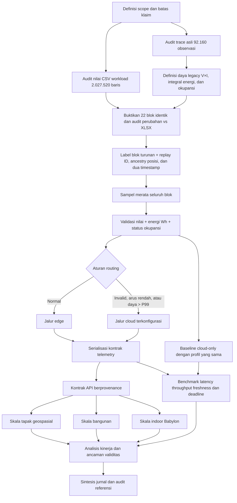

# Alur evaluasi Digital Twin edge–cloud multiskala

Alur tidak memuat generator sintetis, train–validation–test, atau estimator
daya. Seluruh 2.027.520 baris CSV dipindai untuk audit lineage dan kualitas;
benchmark hanya memproses 5.000 posisi merata. Karena 22 blok mempunyai payload
identik, CSV tidak memberi 22 variasi observasi baru. Unit analisis lapangan
tetap trace sumber 92.160 observasi dari satu gateway. Energi adalah integral
proksi V×I per siklus dan okupansi berasal dari data legacy. Integrasi tiga
skala berorientasi monitoring satu arah dengan LoD-A tapak, LoD-B bangunan,
dan LoD-C indoor. Hirarki LoD aplikatif tersebut belum diuji sebagai kepatuhan
LoD geometrik CityGML/IndoorGML/IFC/3D Tiles, dan sistem belum membuktikan
Digital Twin operasional dua arah.
