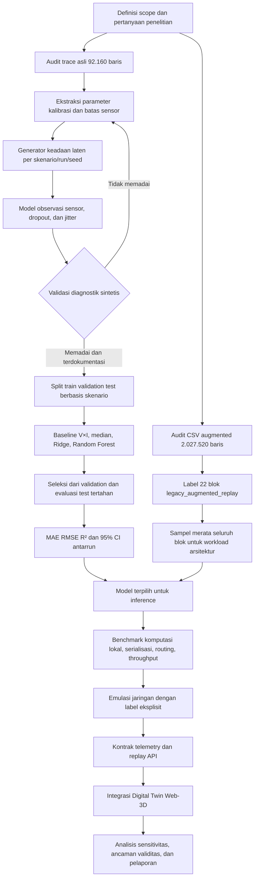

# Alur penelitian baru

Alur ini menggantikan gambar lama yang menyebut fusi multimodal dan kontrol.
Keduanya tidak didukung oleh bukti data dan bukan bagian dari scope penelitian
yang diperbarui.

Cabang sintetis menghasilkan bukti akurasi estimator. Cabang augmented
menghasilkan bukti workload arsitektur. Keduanya bertemu saat model terpilih
dijalankan pada jalur inference, tetapi metrik akurasi tidak pernah dihitung
dari data augmented.
